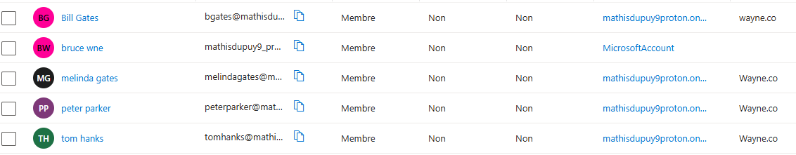

#Le sujet de ce lab est la gestion d'identité.

#J'ai créé des users, manuellement sur le site et avec powershell.

#Ensuite avec le même système j'eu créé des groupes.

#Enfin, j'attribue un rôle d'admin à l'user Bill Gates.

#manuellement:

#powershell:

#résultat:

#J'ai créé des groupes, de la même manières sur le site ou avec l'outil powershell

#manuellement:

#powershell

#résultat

