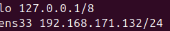

#This labs is an ssh scan and detection with 3 virtual machines, an attacker, a target and a monitor.
#first here are the ipv4 adresses on host-only

#tcpdump running on monitor

#nmap scan

#ssh fail on kali

